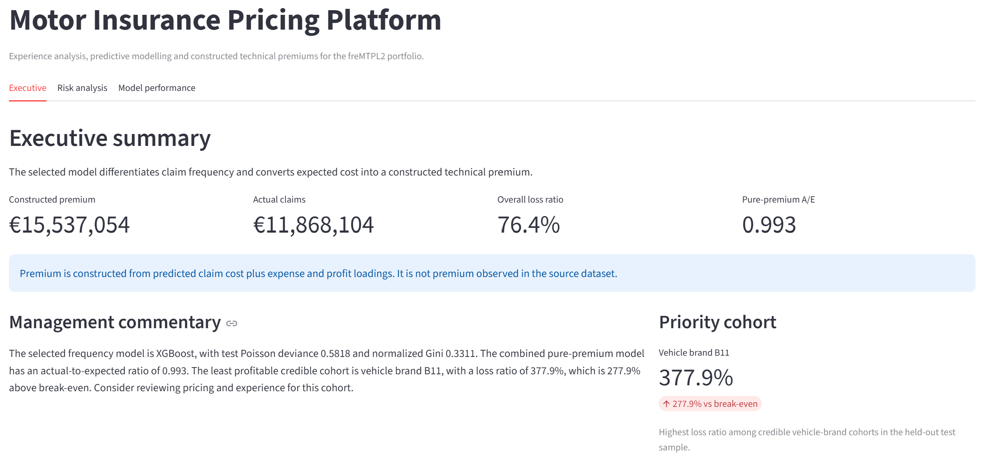
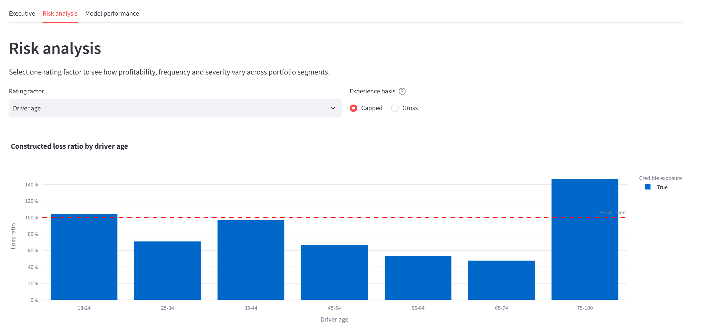
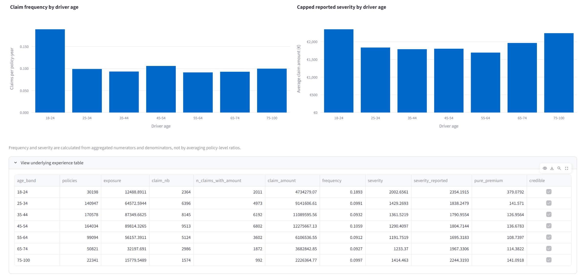
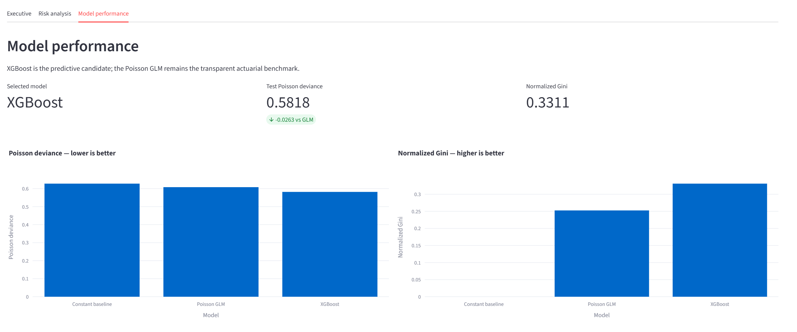
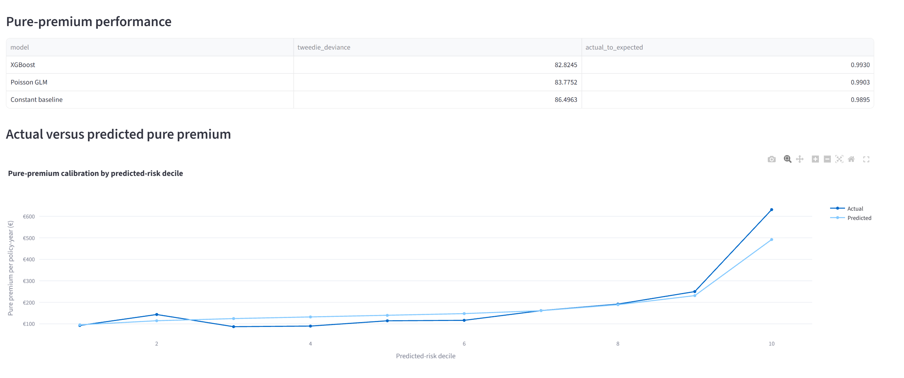
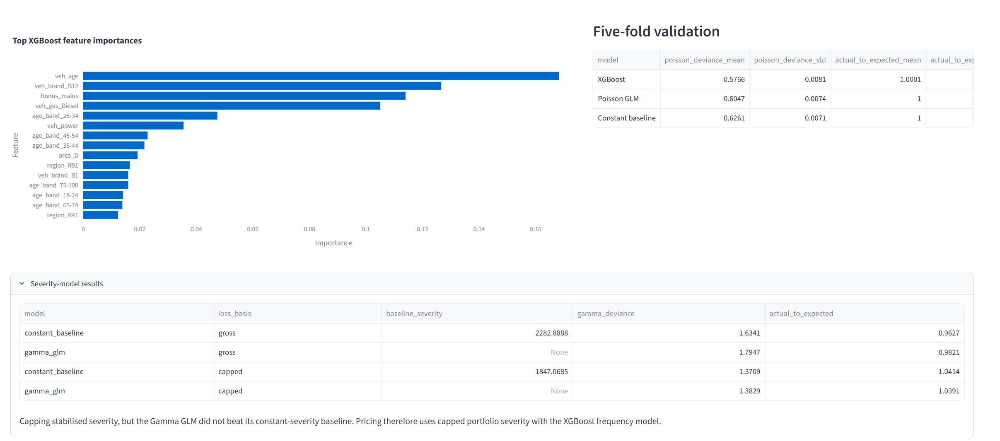
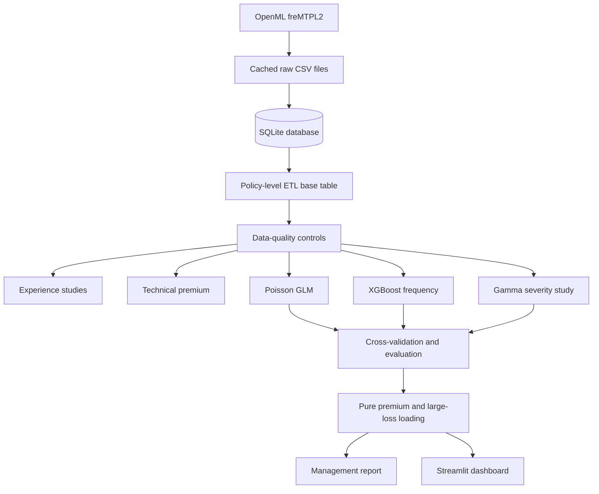

# Motor Insurance Pricing Platform

[](https://github.com/Thinking-fast/motor-pricing/actions/workflows/ci.yml)

An end-to-end actuarial pricing platform that transforms the freMTPL2 French
motor portfolio from raw OpenML data into a SQL database, experience studies,
technical premiums, predictive models, management reporting and an interactive
Streamlit dashboard.

The project demonstrates the full path from source data to a governed pricing
recommendation, not an isolated modelling notebook.

## Key results

- Analysed **678,013 policy records**.
- XGBoost achieved test Poisson deviance of **0.5818**, compared with **0.6081**
  for the Poisson GLM.
- XGBoost achieved normalized Gini of **0.3311**, compared with **0.2526** for
  the GLM.
- Five-fold cross-validation confirmed the model ranking.
- The selected pure-premium model achieved Tweedie deviance of **82.8245** and
  portfolio actual-to-expected of **0.9930**.
- Capping policy-level aggregate losses at EUR 100,000 reduced Gamma severity
  deviance from **1.7947 to 1.3829**.
- The Gamma GLM did not beat its constant-severity baseline, so the selected
  method uses XGBoost frequency with capped portfolio severity and a
  training-derived large-loss loading.
- The least-profitable credible one-way cohorts were vehicle brand B11, vehicle
  brand B10 and drivers aged 75–100.

## Dashboard

The Streamlit application is curated for two audiences:

- **Executive:** constructed premium, actual claims, portfolio loss ratio,
  pure-premium calibration and concise management commentary.
- **Risk analysis:** loss ratio, frequency and severity by driver age, region,
  vehicle brand, fuel type and area, with gross/capped experience controls.
- **Model performance:** GLM versus XGBoost results, five-fold validation,
  feature importance, severity diagnostics and actual-versus-predicted
  calibration.

Launch it after running the pipeline:

```bash
python -m streamlit run app/streamlit_app.py
```

Then open `http://localhost:8501` if a browser does not open automatically.








## Why it matters

Insurance pricing is more than fitting a model. Policies have different
exposure periods, claim counts must reconcile with amount records, large losses
can dominate small segments, and predictions must be both calibrated and
explainable.

This platform connects those actuarial decisions to reproducible engineering:
SQL extraction, tested data-quality controls, cross-validation, model
comparison, technical-premium construction, automated reporting and an
audience-specific dashboard.

## Architecture



One command rebuilds the analytical outputs:

```bash
python run_pipeline.py
```

## Actuarial methodology

### Experience study

One-way analyses are produced for driver-age band, region, vehicle brand,
vehicle fuel type and area. Metrics are calculated after aggregating their
numerators and denominators:

```text
frequency    = total reported claim incidents / total exposure
severity     = total claim amount / total reported claim incidents
pure premium = total claim amount / total exposure
```

This exposure-weighted approach avoids the classic error of averaging
policy-level ratios. Segments below 1,000 policy-years are flagged as not
credible rather than silently removed.

### Frequency modelling

The Poisson GLM models policy claim count with a `log(exposure)` offset:

```text
log(expected claim count) = rating-factor effects + log(exposure)
```

The offset makes the model estimate an annual claim rate while respecting each
policy's observed exposure. Exponentiated coefficients provide interpretable
rating relativities.

XGBoost predicts annual frequency with a Poisson objective and policy exposure
as the sample weight. Categorical encoding is fitted inside a scikit-learn
pipeline to avoid preprocessing leakage.

### Severity and large losses

A claim-count-weighted Gamma GLM with a log link is fitted to positive,
amount-bearing claims. Both gross and capped versions are evaluated.

Claim amounts are available as policy-level aggregates, so the configured
€100,000 threshold is a **policy-total cap**, not an individual-claim cap. The
removed cost is restored through a portfolio loading estimated using training
data only:

```text
large-loss loading = training excess / training exposure
```

The selected loading is **€31.98 per policy-year**. Capping materially improves
severity stability, but the Gamma GLM still does not outperform its constant
baseline.

### Pure premium

The selected annual pure-premium rate is:

```text
XGBoost frequency
× capped severity per reported incident
+ portfolio large-loss loading
```

Frequency and pricing severity use the same `claim_nb` denominator, ensuring
their product reconstructs capped aggregate cost.

### Technical premium

freMTPL2 contains no premium actually charged to policyholders. The project
therefore constructs an illustrative technical premium:

```text
technical premium
    = predicted claim cost × (1 + expense loading + profit loading)
```

The configured assumptions are a 25% expense loading and 5% profit/capital
loading. Resulting loss ratios measure performance against this constructed
benchmark, not the insurer's historical profitability.

## Model validation

The portfolio is split 80/20 using seed 42. Five-fold stratified
cross-validation is performed inside the training sample, while the held-out
test sample is reserved for final evaluation.

### Frequency results

| Model | Poisson deviance ↓ | Normalized Gini ↑ | A/E |
|---|---:|---:|---:|
| Constant baseline | 0.6277 | 0.0000 | 1.0049 |
| Poisson GLM | 0.6081 | 0.2526 | 1.0059 |
| XGBoost | **0.5818** | **0.3311** | 1.0094 |

XGBoost provides the strongest predictive performance and risk ranking. The
Poisson GLM remains the transparent benchmark and governance challenger.

### Severity results

| Loss basis | Model | Gamma deviance ↓ | Amount A/E |
|---|---|---:|---:|
| Gross | Constant baseline | **1.6341** | 0.9627 |
| Gross | Gamma GLM | 1.7947 | **0.9821** |
| Capped | Constant baseline | **1.3709** | 1.0414 |
| Capped | Gamma GLM | 1.3829 | **1.0391** |

The severity result is deliberately retained: variables that predict whether a
claim occurs do not necessarily predict its eventual size. The project does
not force an underperforming model into the selected pricing approach.

### Pure-premium results

| Frequency component | Tweedie deviance ↓ | Claim-cost A/E |
|---|---:|---:|
| Constant baseline | 86.4963 | 0.9895 |
| Poisson GLM | 83.7752 | 0.9903 |
| XGBoost | **82.8245** | **0.9930** |

See the [Model Validation Report](docs/MODEL_VALIDATION.md) for detailed
methodology, diagnostics, limitations and the production recommendation.

## Management reporting

The pipeline generates a deterministic management paragraph from validated
metrics without needing an API key or paid service. An optional OpenAI path is
available, but automatically falls back when no key, quota or connection is
available.

Python calculates all figures before narrative generation. The language model,
when enabled, is instructed to use only supplied metrics and not invent or
alter numbers.

## Quickstart

### 1. Clone the repository

```bash
git clone https://github.com/Thinking-fast/motor-pricing.git
cd motor-pricing
```

### 2. Create and activate a virtual environment

Windows PowerShell:

```powershell
python -m venv .venv
.\.venv\Scripts\Activate.ps1
```

macOS or Linux:

```bash
python -m venv .venv
source .venv/bin/activate
```

### 3. Install dependencies

```bash
python -m pip install --upgrade pip
python -m pip install -r requirements.txt
```

### 4. Run the complete pipeline

```bash
python run_pipeline.py
```

The first run downloads freMTPL2 and builds the SQLite database. Later runs
reuse the cached source data and a populated database while regenerating the
analytical outputs.

To rebuild the database explicitly:

```bash
python run_pipeline.py --force-reload
```

### 5. Launch the dashboard

```bash
python -m streamlit run app/streamlit_app.py
```

## Project structure

```text
motor-pricing/
├── app/                         # Streamlit dashboard
├── data/
│   ├── raw/                     # Cached source data, excluded from Git
│   └── processed/               # Database and generated outputs, excluded from Git
├── docs/                        # Data and model governance
├── sql/                         # Relational schema
├── src/
│   ├── analysis/                # Experience studies and large-loss treatment
│   ├── data/                    # Download and database loading
│   ├── etl/                     # SQL extraction and data-quality controls
│   ├── models/                  # GLMs, XGBoost and evaluation
│   ├── pipelines/               # Stage-specific orchestration
│   ├── pricing/                 # Technical-premium construction
│   └── reporting/               # Deterministic and optional LLM narrative
├── tests/                       # Isolated unit and orchestration tests
├── config.yaml                  # Central assumptions and model settings
├── requirements.txt
└── run_pipeline.py              # One-command end-to-end pipeline
```

## Data-quality controls

The tested pipeline:

- Caps 1,224 exposure values above one policy-year.
- Caps 209 bonus-malus values above 150.
- Preserves no-claim policies with zero rather than missing claim cost.
- Flags 9,117 policies where incident counts differ from amount-bearing claim
  rows.
- Normalises vehicle-fuel labels.
- Includes drivers aged exactly 100 in the final age band.
- Produces gross and capped large-loss views.
- Flags low-exposure cells instead of dropping them.

See [Data Quality](docs/DATA_QUALITY.md) for the decision record and remaining
issues.

## Limitations

- Premium is constructed rather than observed.
- Reported incident counts and amount-bearing claim rows do not always agree.
- Large-loss treatment applies to policy aggregates, not individual claims.
- Validation uses a random split rather than an out-of-time sample.
- Severity differentiation is weak and unstable.
- Credibility uses a pragmatic exposure threshold rather than formal
  credibility theory.
- Feature importance measures model usage, not causality or direction.
- Regulatory, fairness and operational approval would be required before live
  pricing use.

This project is for education and portfolio demonstration, not production
quoting.

## Testing and reproducibility

Run the same checks used by GitHub Actions:

```bash
black --check run_pipeline.py src app tests
flake8 run_pipeline.py src app tests --max-line-length=100 --extend-ignore=E203,W503
pytest -q
```

The project currently contains **58 tests** and uses:

- A central configuration file
- One reproducible random seed
- Train-only preprocessing
- Five-fold cross-validation
- A held-out test sample
- Idempotent pipeline orchestration
- Automated formatting, lint and test checks

## Documentation

- [Data Dictionary](docs/DATA_DICTIONARY.md)
- [Data Quality Assessment](docs/DATA_QUALITY.md)
- [Model Validation Report](docs/MODEL_VALIDATION.md)

## Production recommendation

For this portfolio demonstration, use XGBoost frequency with capped portfolio
severity and the training-derived large-loss loading. Retain the Poisson GLM as
an interpretable benchmark.

Before production use, obtain observed premium and individual-claim data,
perform temporal validation, assess fairness and regulatory constraints, and
establish formal data-drift and calibration monitoring.

## License

MIT—see [LICENSE](LICENSE).
